<a href="https://portfolio-mansi-eight.vercel.app/">Portfolio</a> · <a href="https://www.linkedin.com/in/mansidhruv/">LinkedIn</a> · <a href="mailto:mansi.p.dhruv@gmail.com">Email</a>

---

## Who Am I

I Build Production Data Systems Across **AWS, Databricks, Spark And PySpark**. My Work Sits Between **Platform Engineering, Distributed Processing And Performance Engineering** — From Designing Pipelines To Understanding What The Engine Is Doing Underneath Them.

The Longer Arc Is Deliberate: **Data Platforms → Distributed Systems → Performance → Accelerated Data Systems**, With **Semantic Data And GenAI** Becoming Another Layer Of The Stack.

---

## Proven Record & Trajectory Prism

**7+ Years Building Production Data Systems · Master's Graduate · GEM Award Recipient**

- **Production Scale & Platforms**: Architected multi-terabyte medallion lakehouses across AWS and Databricks with incremental Auto Loader ingestion, automated schema evolution, and Unity Catalog governance.
- **Measured Performance Optimization**: Engineered 24% byte scan reductions through partition and clustering trade-off analysis, eliminated memory shuffle spills, and tuned distributed query execution.
- **Data Integrity & CDC**: Built resilient pipelines utilizing Delta Change Data Feed, SCD Type 1 & 2 dimensional merges, and automated Great Expectations quarantine dead-letter gates.
- **Future Direction**: Advancing from Spark internals and query execution into parallel computing, NVIDIA CUDA, and GPU-accelerated data processing (RAPIDS / cuDF).

---

## Systems Topology & Pipeline Flow

---

## Sentinel Lakehouse

**Incremental Ingestion · Data Quality · CDC · SCD1/SCD2 · Observability · Governance**

<a href="https://github.com/MsMansiDhruv/sentinel-lakehouse">Explore Sentinel →</a>

---

## Systems Stack

  
  &nbsp;&nbsp;
  
  &nbsp;&nbsp;
  
  &nbsp;&nbsp;
  
  &nbsp;&nbsp;
  
  &nbsp;&nbsp;
  
  &nbsp;&nbsp;
  
  &nbsp;&nbsp;
  
  &nbsp;&nbsp;
  
  &nbsp;&nbsp;
  
  &nbsp;&nbsp;
  

---

## Vision / Let's Collaborate

I Am Interested In Problems Where **Data, Systems, Performance And Intelligence** Meet — Especially **Data Platforms, Spark And Query Execution, Performance Experiments, Semantic Data, GenAI Workflows And GPU-Accelerated Data Systems**.

<a href="mailto:mansi.p.dhruv@gmail.com">Let's Build Something Worth Measuring →</a>
