<a href="https://portfolio-mansi-eight.vercel.app/">Portfolio</a> · <a href="https://www.linkedin.com/in/mansidhruv/">LinkedIn</a> · <a href="mailto:mansi.p.dhruv@gmail.com">Email</a>

---

## Who Am I

I Build Production Data Systems Across **AWS, Databricks, Spark And PySpark**. My Work Sits Between **Platform Engineering, Distributed Processing And Performance Engineering** — From designing pipelines to understanding what the engine is doing underneath them.

The Longer Arc Is Deliberate: **Data Platforms → Distributed Systems → Performance → Accelerated Data Systems**, with **Semantic Data And GenAI** becoming another layer of the stack.

---

## Data In Motion

---

## Systems Map

---

## Sentinel Lakehouse

**Incremental Ingestion · Data Quality · CDC · SCD1/SCD2 · Observability · Governance**

<a href="https://github.com/MsMansiDhruv/sentinel-lakehouse">Explore Sentinel →</a>

---

## Systems Stack

  
  
  
  
  
  
  
  
  
  
  
  

---

## Vision / Let's Collaborate

I Am Interested In Problems Where **Data, Systems, Performance And Intelligence** Meet — Especially **Data Platforms, Spark And Query Execution, Performance Experiments, Semantic Data, GenAI Workflows And GPU-Accelerated Data Systems**.

<a href="mailto:mansi.p.dhruv@gmail.com">Let's Build Something Worth Measuring →</a>
