<a href="https://portfolio-mansi-eight.vercel.app/">Portfolio</a> · <a href="https://www.linkedin.com/in/mansidhruv/">LinkedIn</a> · <a href="mailto:mansi.p.dhruv@gmail.com">Email</a>

---

## Who Am I

I Build Production Data Systems Across **AWS, Databricks, Spark And PySpark**. My Work Sits Between **Platform Engineering, Distributed Processing And Performance Engineering** — From Designing Pipelines To Understanding What The Engine Is Doing Underneath Them.

The Longer Arc Is Deliberate: **Data Platforms → Distributed Systems → Performance → Accelerated Data Systems**, With **Semantic Data And GenAI** Becoming Another Layer Of The Stack.

---

## Space-Time Trajectory Flux

A Live Visual Representation Of **7+ Years Of Production Systems Evolution**:
- **Foundations & Academic Core**: Master in Computer Applications (MCA), GEM Award For Technical Leadership, Python & SQL Modeling.
- **Enterprise Cloud Migration**: Architected AWS Framework (Glue, Redshift, DMS, S3) For Financial Datasets (Tata AMC) Handling 10+ TB With 40% Automation Efficiency.
- **High-Throughput Streaming**: Databricks, PySpark, Delta Live Tables & Kafka/Kinesis Real-Time Scoring (Acorns) Delivering 40% Pipeline Time Reduction & 30% Cost Savings.
- **Accelerated Frontier**: Advancing Into Spark Catalyst Optimization, Off-Heap Tungsten Memory, And GPU Kernel Acceleration (NVIDIA CUDA & RAPIDS cuDF).

---

## Measured Systems Benchmarks & Trade-Offs

- **I/O & File Pruning**: Liquid Clustering Reduced Bytes Scanned By **24%** Across Analytical Predicates, Measured Against Serverless Cluster Startup Overheads.
- **Memory & Shuffle Optimization**: Mitigated High-Cardinality Skew Via AQE Dynamic Split & Adaptive Broadcast Switching, Eliminating **100GB+ Disk Spills**.
- **Real-Time Stream Processing**: Engineered End-to-End Streaming Scoring With **40% Latency Acceleration** And **30% Compute Cost Reduction**.
- **Metadata-Driven Cloud Migration**: Automated Migration Of **10+ TB** Financial Data To Redshift With Reproducible Terraform IaC And Zero-Loss Observability.

---

## Distributed Engine & Query Execution Topology

---

## Flagship Engineering: Sentinel Lakehouse

**Incremental Ingestion · Data Quality · CDC · SCD1/SCD2 · Observability · Governance**

<a href="https://github.com/MsMansiDhruv/sentinel-lakehouse">Explore Sentinel Lakehouse Repository →</a>

---

## Systems Laboratories & Codebases

<table>
  <tr>
    <td width="50%" valign="top">
      <h3>🛡️ <a href="https://github.com/MsMansiDhruv/sentinel-lakehouse">Sentinel Lakehouse</a></h3>
      
<strong>Flagship Production Architecture</strong>

      
Full Medallion Lakehouse engine on Databricks with Auto Loader incremental ingestion, Delta Change Data Feed (CDF), SCD Type 1 & Type 2 dimensional models, automated Great Expectations quarantine dead-letter gates, and Unity Catalog lineage.

      
<code>Databricks</code> · <code>Delta Lake</code> · <code>PySpark</code> · <code>Unity Catalog</code> · <code>pytest</code> · <code>CI/CD</code>

    </td>
    <td width="50%" valign="top">
      <h3>⚡ <a href="https://github.com/MsMansiDhruv/gquery-engine-clone">Query Engine Laboratory</a></h3>
      
<strong>Systems Internals & Execution Exploration</strong>

      
A specialized technical laboratory exploring SQL query parsing, relational execution trees, vectorized columnar batch processing, predicate pushdown algorithms, and in-memory operator performance.

      
<code>Query Execution</code> · <code>Columnar Layout</code> · <code>Vectorized Kernels</code> · <code>Memory Planning</code>

    </td>
  </tr>
</table>

---

## Verified Credentials & Mastery

---

## Systems Stack

  
  &nbsp;&nbsp;
  
  &nbsp;&nbsp;
  
  &nbsp;&nbsp;
  
  &nbsp;&nbsp;
  
  &nbsp;&nbsp;
  
  &nbsp;&nbsp;
  
  &nbsp;&nbsp;
  
  &nbsp;&nbsp;
  
  &nbsp;&nbsp;
  
  &nbsp;&nbsp;
  

---

## Vision / Let's Collaborate

I Am Interested In Problems Where **Data, Systems, Performance And Intelligence** Meet — Especially **Data Platforms, Spark And Query Execution, Performance Experiments, Semantic Data, GenAI Workflows And GPU-Accelerated Data Systems**.

<a href="mailto:mansi.p.dhruv@gmail.com">Let's Build Something Worth Measuring →</a>
