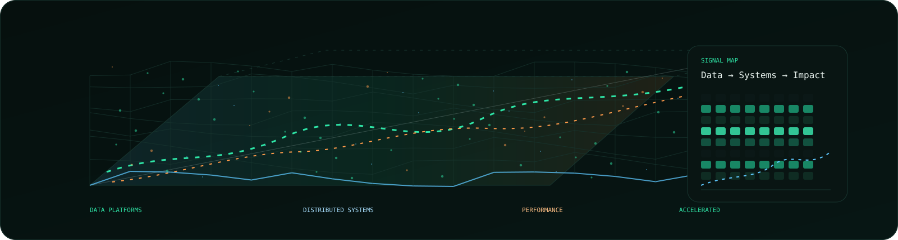

<a href="https://portfolio-mansi-eight.vercel.app/">Portfolio</a> · <a href="https://www.linkedin.com/in/mansidhruv/">LinkedIn</a> · <a href="mailto:mansi.p.dhruv@gmail.com">Email</a>

---

## Who Am I

I Build Data Platforms Today, Go Deeper Into Distributed Systems And Performance Engineering, And Keep Moving Toward Accelerated Data Systems.

## Contribution Field

This Is The Public Part Of The Work. Most Production Systems Stay Private, So GitHub Is Where I Make The Reproducible Pieces Visible.

---

## Wireframe Terrain

I Work Across The Data Path: Build The Platform, Understand The Engine, Measure The Cost, Then Push The Boundary.

---

## Sentinel Lakehouse

A Databricks Lakehouse Built Around **Schema Evolution, Data Quality, Quarantine, CDC, SCD1/SCD2, Observability, Governance And Performance Trade Offs**.

**Databricks · Spark · Delta Lake · Lakeflow · Auto Loader · Unity Catalog**

[Read The Engineering Decisions](https://github.com/MsMansiDhruv/sentinel-lakehouse)

---

## Engineering Labs

**Query Engine Lab**  
SQL → Logical Plan → Optimization → Physical Plan → Execution

**Spark Performance Lab**  
Partitioning · Joins · Shuffle · Skew · AQE · Caching · Predicate Pushdown · Execution Plans

**Distributed Systems Experiments**  
Replication · Consistency · Fault Tolerance · Concurrency · Data Movement

These Are Small, Reproducible Projects For Understanding What Larger Systems Are Actually Doing.

---

## Systems Stack

  

  

---

---

## Engineering Direction

**Current Practice** · Data Platforms · AWS · Databricks · Spark  
**Current Study** · Spark Internals · Distributed Query Execution · Performance Engineering  
**Longer Arc** · Parallel Computing · CUDA · RAPIDS · GPU Data Systems

---

## Vision / Let's Collaborate

I Like Problems Where **Data, Systems, Performance And Product Thinking** Meet.

For Collaboration, I Am Interested In **Data Platforms, Spark And Query Execution, Performance Experiments, Semantic Systems, GenAI Data Workflows And GPU Accelerated Data Systems**.

---

### Building Systems. Measuring Them. Learning What Breaks.

<a href="https://github.com/MsMansiDhruv/sentinel-lakehouse">Sentinel</a> · <a href="https://portfolio-mansi-eight.vercel.app/">Portfolio</a> · <a href="https://www.linkedin.com/in/mansidhruv/">LinkedIn</a> · <a href="mailto:mansi.p.dhruv@gmail.com">Email</a>

