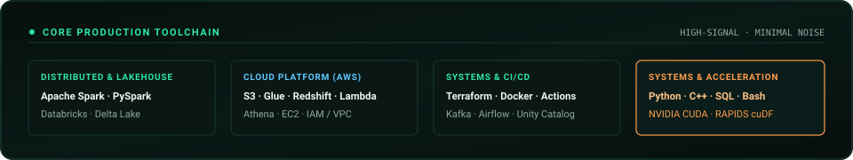

<a href="https://portfolio-mansi-eight.vercel.app/">Portfolio</a> · <a href="https://www.linkedin.com/in/mansidhruv/">LinkedIn</a> · <a href="mailto:mansi.p.dhruv@gmail.com">Email</a>

---

## Who Am I

I Build Production Data Systems Across **AWS, Databricks, Spark And PySpark**. My Work Sits Between **Platform Engineering, Distributed Processing And Performance Engineering** — From Designing Pipelines To Understanding What The Engine Is Doing Underneath Them.

The Longer Arc Is Deliberate: **Data Platforms → Distributed Systems → Performance → Accelerated Data Systems**, With **Semantic Data And GenAI** Becoming Another Layer Of The Stack.

---

## Space-Time Trajectory Flux

A Live Visual Representation Of **7+ Years Of Production Systems Evolution**:
- **Foundations & Academic Core**: Master in Computer Applications (MCA), GEM Award For Technical Leadership, Python & SQL Modeling.
- **Enterprise Cloud Migration**: Architected AWS Framework (Glue, Redshift, DMS, S3) For Financial Datasets (Tata AMC) Handling 10+ TB With 40% Automation Efficiency.
- **High-Throughput Streaming**: Databricks, PySpark, Delta Live Tables & Kafka/Kinesis Real-Time Scoring (Acorns) Delivering 40% Pipeline Time Reduction & 30% Cost Savings.
- **Accelerated Frontier**: Advancing Into Spark Catalyst Optimization, Off-Heap Tungsten Memory, And GPU Kernel Acceleration (NVIDIA CUDA & RAPIDS cuDF).

---

## Distributed Engine & Query Execution Topology

---

## Sentinel Lakehouse

**Incremental Ingestion · Data Quality · CDC · SCD1/SCD2 · Observability · Governance**

<a href="https://github.com/MsMansiDhruv/sentinel-lakehouse">Explore Sentinel →</a>

---

## Verified Credentials & Mastery

---

## Systems Stack

  
  &nbsp;&nbsp;
  
  &nbsp;&nbsp;
  
  &nbsp;&nbsp;
  
  &nbsp;&nbsp;
  
  &nbsp;&nbsp;
  
  &nbsp;&nbsp;
  
  &nbsp;&nbsp;
  
  &nbsp;&nbsp;
  
  &nbsp;&nbsp;
  
  &nbsp;&nbsp;
  

---

## Vision / Let's Collaborate

I Am Interested In Problems Where **Data, Systems, Performance And Intelligence** Meet — Especially **Data Platforms, Spark And Query Execution, Performance Experiments, Semantic Data, GenAI Workflows And GPU-Accelerated Data Systems**.

<a href="mailto:mansi.p.dhruv@gmail.com">Let's Build Something Worth Measuring →</a>
