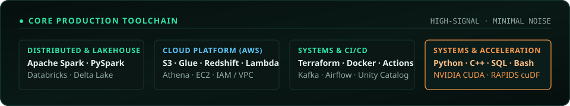

 

  <a href="https://portfolio-mansi-eight.vercel.app/"><strong>Portfolio</strong></a> &nbsp;·&nbsp;
  <a href="https://portfolio-mansi-eight.vercel.app/projects"><strong>Architecture Case Studies</strong></a> &nbsp;·&nbsp;
  <a href="https://www.linkedin.com/in/mansidhruv/"><strong>LinkedIn</strong></a> &nbsp;·&nbsp;
  <a href="mailto:mansi.p.dhruv@gmail.com"><strong>Email</strong></a>

---

## Who Am I

> *"I build reliable data platforms — from raw inputs to decisions teams can trust."*

I build production data systems across **AWS, Databricks, Apache Spark, and Delta Lake**. My work spans **platform engineering, distributed processing, and query performance** — from architecting petabyte-scale pipelines to understanding what the execution engine is doing underneath them.

Most of my work starts as a migration or cost bottleneck and turns into an architecture problem. I like the second part.

### 📐 How I Think (Core Design Principles)

* **Operability over Cleverness:** *"I'd rather ship a boring reliable pipeline than a clever fragile one."* Build it so someone can operate it without waking up the author.
* **Cost is an Architecture Parameter:** Every architectural decision has a cost somewhere—you choose where and when you pay it. Treat cloud compute costs as design constraints, not invoice surprises.
* **Observability isn't a Dashboard:** Observability is knowing when to worry, bounding the blast radius of bad data, and automating partition-pruned recovery before downstream consumers are impacted.
* **Workload-Specific Architecture:** When one store is struggling under simultaneous OLTP and OLAP demands, the flaw is usually the workload mix, not the database engine.
* **Engine Internals over Black-Box Scaling:** The interesting part of high-throughput data engineering isn't throwing bigger clusters at the problem—it's understanding memory layout, partition pruning, and execution plans.

---

## Open Source & Engine Internals Contributions

Active contributions to core distributed data engines, table formats, and query frameworks:

| Engine / Framework | Pull Request | Technical Focus & Scope | CI / Review Status |
| :--- | :--- | :--- | :--- |
| **NVIDIA cuDF Spark** | [#16688](https://github.com/NVIDIA/cudf-spark/pull/16688) | Spark Catalyst multi-digit patch versioning across build tooling, CI, and test matrices | Blossom CI Passed (30+ checks green), Greptile 5/5 |
| **NVIDIA cuDF Spark** | [#16715](https://github.com/NVIDIA/cudf-spark/pull/16715) | `GpuCreateDataSourceTableAsSelectCommand` table drop on `saveAsTable` overwrite (SPARK-60387) | Greptile 5/5, Signoff Passed, Upstream Synced |
| **Apache Iceberg** | [#4265](https://github.com/apache/iceberg-python/pull/4265) | Reference snapshot ID invariant validation during branch snapshot expiration (#4200) | 20/20 CI checks passed, in maintainer queue |
| **Ibis Project** | [#12211](https://github.com/ibis-project/ibis/pull/12211) | Decimal mean type promotion (`float64`) and product precision/scale calculation (#12209) | Semantic Release passed, DCO signed |
| **Databricks dbt** | [#1758](https://github.com/databricks/dbt-databricks/pull/1758) | Relation string literal escaping for metadata queries against catalogs and schemas (#1747) | 100% PR Test Coverage, 8/8 CI checks passed |

---

## Systems Topography & Execution Depth

### Engineering Trajectory Arc:
* **Data Platforms & Lakehouses**: Architected AWS frameworks (Glue, Redshift, DMS, S3) for financial datasets (Tata AMC) handling 10+ TB with 40% automation efficiency.
* **Distributed Processing & Streaming**: Engineered Databricks, PySpark, Delta Live Tables & Kafka/Kinesis real-time scoring (Acorns) delivering 40% latency reduction and 30% compute cost savings.
* **Query Optimization & Memory**: Advanced tuning of Catalyst optimizer rules, off-heap Tungsten memory allocation, and AQE dynamic partition coalescing.
* **Accelerated Data Systems**: Pushing into GPU kernel acceleration, columnar batch execution, and SIMD vectorization with NVIDIA CUDA & RAPIDS cuDF.

---

## Flagship Engineering: Sentinel Lakehouse & Compound GenAI Engine

**Incremental Ingestion · Data Quality · CDC · SCD1/SCD2 · Observability · Governance**

<a href="https://github.com/MsMansiDhruv/sentinel-lakehouse">Explore Sentinel Lakehouse Repository →</a>

---

## GenAI & AI/BI Architecture: Sentinel-GenAI Studio

**Databricks Genie AI/BI · Mosaic AI Vector Search · Incident RCA · Compound Query Routing**

* **Genie-Bench (Semantic Layer & Evaluation Harness)**: Semantic metadata compiler generating Unity Catalog table annotations, join graphs, and verified SQL definitions with SQLGlot AST equivalence matching in ~85ms offline.
* **AutoHeal-DE (Pipeline Incident RCA & Healing)**: Live Delta commit log analyzer detecting late-arriving partitions, bounding historical window blast radii, and generating surgical partition-pruned Delta `MERGE` statements without expensive full-table backfills.
* **Hybrid Compound Router**: Fuses structured Databricks SQL aggregations with unstructured Mosaic AI Vector Search chunks via Reciprocal Rank Fusion (RRF k=60) with numerical consistency guardrails.

<a href="https://github.com/MsMansiDhruv/sentinel-lakehouse/blob/main/notebooks/14_sentinel_genai_hybrid_rag.ipynb">Explore Interactive Hybrid RAG & Genie Demo Notebook →</a>

---

## Systems Laboratories & Codebases

<table>
  <tr>
    <td width="50%" valign="top">
      <h3><a href="https://github.com/MsMansiDhruv/sentinel-lakehouse">Sentinel Lakehouse &amp; Sentinel-GenAI</a></h3>
      
<strong>Flagship Production Architecture</strong>

      
Full Medallion Lakehouse engine on Databricks with Auto Loader incremental ingestion, Delta Change Data Feed (CDF), SCD Type 1 &amp; Type 2 dimensional models, automated Great Expectations quarantine dead-letter gates, Unity Catalog lineage, and the Sentinel-GenAI hybrid RAG engine.

      
<code>Databricks</code> · <code>Delta Lake</code> · <code>PySpark</code> · <code>Unity Catalog</code> · <code>Mosaic AI</code> · <code>pytest</code> · <code>CI/CD</code>

    </td>
    <td width="50%" valign="top">
      <h3><a href="https://github.com/MsMansiDhruv/gquery-engine-clone">Query Engine Laboratory</a></h3>
      
<strong>Systems Internals &amp; Vectorized Execution</strong>

      
In-memory relational query execution engine exploring columnar memory layout (<code>ColumnVector</code>), batch iteration (<code>RecordBatch</code>) to reduce virtual dispatch overhead, predicate pushdown algorithms, and bitmask selection vectors.

      
<code>Query Execution</code> · <code>Columnar Layout</code> · <code>Vectorized Kernels</code> · <code>Memory Planning</code>

    </td>
  </tr>
  <tr>
    <td width="50%" valign="top">
      <h3><a href="https://github.com/MsMansiDhruv/dlt-doctor">dlt-doctor</a></h3>
      

        
        
        
        
      

      
<strong>Databricks DLT &amp; PySpark Optimization Engine</strong>

      
Open-source static AST optimizer and quality engine for Databricks. Features 12 diagnostic engines: Catalyst plan bloat auditing, zero-loss quarantine streams, bounded late-partition MERGE restatement, Unity Catalog migration, Liquid Clustering advisory, live workspace telemetry, and DBU cost forecasting.

      
<code>pip install dlt-doctor</code> · <code>PySpark Catalyst</code> · <code>Delta Live Tables</code> · <code>Auto Loader</code> · <code>GitHub Action</code>

    </td>
    <td width="50%" valign="top">
      <h3><a href="https://github.com/MsMansiDhruv/sentinel-lakehouse#autoheal-de">AutoHeal-DE: Lakehouse Pipeline Self-Healing</a></h3>
      
<strong>Self-Healing Pipelines &amp; Incident RCA</strong>

      
Zero-scan Delta commit log monitor detecting late-arriving partitions, bounding rolling-window blast radii, and executing surgical partition-pruned Delta MERGE reconciliations without costly full-table restatements.

      
<code>Delta Lake CDF</code> · <code>Commit Log Inspection</code> · <code>AST Query Rewriter</code> · <code>Surgical Reconciler</code>

    </td>
  </tr>
</table>

---

## Measured Systems Benchmarks & Trade-Offs

* **I/O & File Pruning**: Liquid clustering reduced bytes scanned by **24%** across analytical predicates, measured against serverless cluster startup overheads.
* **Memory & Shuffle Optimization**: Mitigated high-cardinality skew via AQE dynamic split and adaptive broadcast switching, eliminating **100GB+ disk spills**.
* **Real-Time Stream Processing**: Engineered end-to-end streaming scoring with **40% latency acceleration** and **30% compute cost reduction**.
* **Metadata-Driven Cloud Migration**: Automated migration of **10+ TB** financial data to Redshift with reproducible Terraform IaC and zero-loss observability.

---

## Distributed Engine & Query Execution Topology

---

## Verified Credentials & Mastery

* **AWS Certified Cloud Practitioner** (Amazon Web Services)
* **GEM Award (2023)** — SG Analytics: *Awarded for delivering exceptional business value and architecture leadership on enterprise client data platforms.*
* **Value-able Award (2024)** — SG Analytics: *Recognized for establishing critical client architectural foundations.*
* **Master in Computer Applications (MCA)** — AESICS: *Full Year Merit-Based Scholarship recipient.*

---

## Systems Stack

  
  &nbsp;&nbsp;
  
  &nbsp;&nbsp;
  
  &nbsp;&nbsp;
  
  &nbsp;&nbsp;
  
  &nbsp;&nbsp;
  
  &nbsp;&nbsp;
  
  &nbsp;&nbsp;
  
  &nbsp;&nbsp;
  
  &nbsp;&nbsp;
  
  &nbsp;&nbsp;
  

---

  Complexity → operability &nbsp;·&nbsp; <a href="https://portfolio-mansi-eight.vercel.app/">portfolio-mansi-eight.vercel.app</a> &nbsp;·&nbsp; Mansi Dhruv

